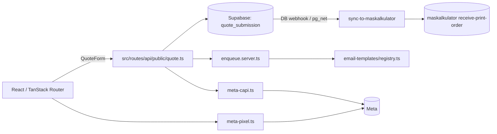

# ARCHITECTURE — mapa dla obcego (1 strona)

**Status: prototype (2026-08) — not maintained.** Ten dokument opisuje kod TAKI, JAKI JEST.

## Co to jest (3 zdania)
Storefront i kalkulator cenowy dla MAS Prints, islandzkiego brokera druku (wizytówki, ulotki,
rollupy, kubki/merch). Klient sam wycenia zamówienie, składa je, a intencją było przesłanie
zamówienia do platformy MAS Group przez edge function `sync-to-maskalkulator`. Model biznesowy:
marża na pośrednictwie w druku — klient płaci MAS Prints, MAS Prints zleca produkcję u drukarni.

## Stack (z package.json)
- Frontend: React 18 + TypeScript + Vite · TanStack Router/Start (plikowy routing w `src/routes/`)
- Styl: Tailwind CSS + Radix UI (shadcn/ui, `components.json`)
- i18n: własny (`src/i18n/messages/{en,is,pl}.ts`) — trzy języki: angielski, islandzki, polski
- Backend/DB: Supabase (Postgres + Auth + RLS + Edge Functions), 10 migracji w `supabase/migrations/`
- Mail: `react-email` + `@lovable.dev/email-js`, szablony w `src/lib/email-templates/`
- Tracking: Meta Pixel + Meta Conversions API (`src/lib/tracking/meta-pixel.ts`, `src/routes/api/public/meta-capi.ts`)
- Hosting: Cloudflare Workers (`wrangler.jsonc`) / Lovable

## Moduły i granice
| Katalog | Odpowiedzialność | Wejście | Tier |
|---|---|---|---|
| `src/routes/products/` | strony produktowe (np. `ecocups.tsx`) z formularzem wyceny | URL | T2 |
| `src/routes/cups.tsx`, `cups.calculator.tsx` | kalkulator cenowy kubków | URL | T1 |
| `src/routes/admin/` | panel admina (`index.tsx`, `login.tsx`) do przeglądu zamówień | URL, auth | T2 |
| `src/routes/api/public/` | `contact.ts`, `quote.ts`, `meta-capi.ts` — przyjęcie formularzy + server-side Meta CAPI | HTTP | T2 |
| `src/routes/email/`, `src/routes/unsubscribe.tsx` | obsługa wypisu z maili transakcyjnych | URL | T2 |
| `src/lib/email/enqueue.server.ts` | kolejkowanie/wysyłka maili po stronie serwera | wywoływane z routes API | T2 |
| `src/lib/email-templates/` | szablony React Email + `registry.ts` (rejestr metadanych — musi żyć osobno od komponentów, bo react-refresh nie lubi mieszanych eksportów) | `registry.ts` | T1 |
| `src/lib/tracking/` | integracja Meta Pixel (klient) + CAPI (serwer) | — | T2 |
| `src/components/site/` | komponenty strony (nagłówek, stopka, formularz wyceny `QuoteForm.tsx`, marquee) | — | T1 |
| `supabase/functions/sync-to-maskalkulator/` | edge fn wołana po INSERT na `quote_submission` (DB webhook/pg_net), przekazuje zamówienie do zewnętrznego webhooka `maskalkulator` | HTTP (Supabase trigger) | T3 |
| `supabase/migrations/` | schemat + RLS (10 plików) | — | T3 |

## Przepływ danych

## Gdzie jest…
- autoryzacja: Supabase Auth + RLS; panel admina za loginem w `src/routes/admin/login.tsx`
- ceny/kwoty: kalkulator kubków w `src/routes/cups.calculator.tsx` — README koryguje wcześniejszy
  błędny zapis o istnieniu golden-snapshot testu; TAKIEGO TESTU W REPO NIE MA
- i18n: `src/i18n/messages/` (en/is/pl), przełącznik `LanguageSwitcher.tsx`
- sekrety: `PRINT_SYNC_SECRET` / `SYNC_WEBHOOK_SECRET` na poziomie edge function (Supabase secrets,
  nie w repo); `.env` trzyma tylko publiczny klucz Supabase
- CI: `.github/workflows/quality.yml` — zdjęte razem z oznaczeniem prototypu, przywrócone tym PR
  po zielonym przebiegu lokalnym (lint/tsc/build/audit); `npm audit fix` podniósł `fast-uri`
  (transitive) — usuwał 1 high (SSRF/host-confusion) i 1 moderate

## Decyzje nieodwracalne
`docs/adr/` — tylko szablon, brak formalnych ADR w trakcie życia projektu.

## Jak to cofnąć / kill switch
Prototyp wygaszony (status: not maintained). `sync-to-maskalkulator` woła zewnętrzny webhook —
jeśli klucz `PRINT_SYNC_SECRET` kiedykolwiek wyciekł, rotacja w Supabase secrets tego projektu i
w `maskalkulator` jednocześnie wyłącza integrację.
